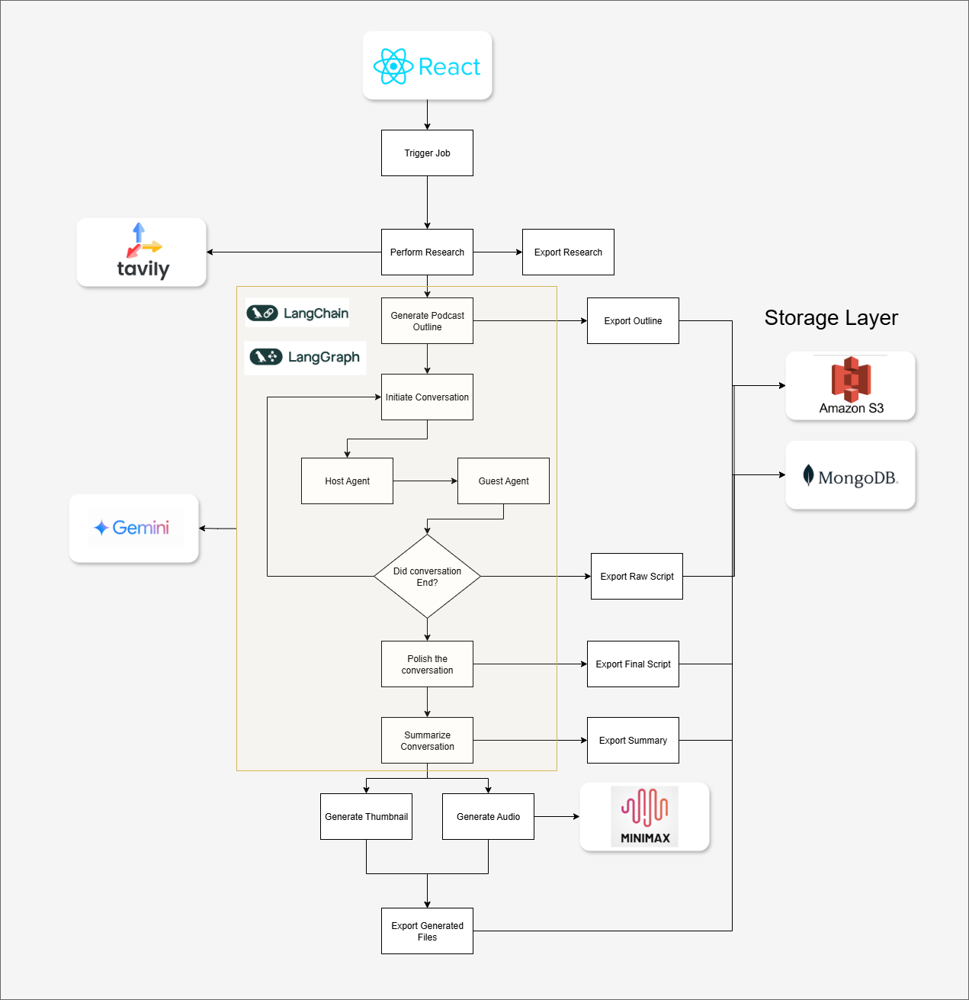

# BotTalks – Automated Podcast Generation

BotTalks is an AI-driven system for generating podcast-style conversations between virtual agents. It automates research, conversation generation, script creation, audio synthesis, and thumbnail generation — delivering a complete podcast episode pipeline.

---

## **Architecture Overview**

The system integrates multiple AI frameworks and services to create a fully automated workflow:

### **Key Components**

* **React Frontend** – User interface to trigger podcast generation jobs and stream the results.
* **LangChain + LangGraph** – Core logic to generate podcast outlines and drive agent-based conversations.
* **Gemini (LLM)** – Provides conversational intelligence for host and guest agents.
* **Tavily** – Performs topic-related research to enrich conversations with facts.
* **Minimax TTS** – Generates high-quality audio for the conversation script.
* **Amazon S3** – Stores generated files like audio, thumbnails, and raw scripts.
* **MongoDB** – Tracks job metadata, research, and conversation states.

---

## **Workflow**

1. **Trigger Job (React Frontend)**
   A podcast generation request is initiated by the user.

2. **Perform Research (Tavily)**
   Relevant facts and topics are researched.

3. **Generate Podcast Outline (LangChain + LangGraph)**
   A structured podcast plan is created with segments and key points.

4. **Host-Guest Conversation (Gemini)**

   * Host and guest agents simulate a dialogue based on the outline and research.
   * The conversation continues until the topic is fully discussed.

5. **Script Polishing and Summarization**

   * Raw conversation script is refined into a final version.
   * A summary is generated for metadata.

6. **Audio and Visual Generation**

   * **Minimax** converts the script into audio (TTS).
   * A thumbnail image is created.

7. **Storage and Delivery**

   * All outputs (outline, raw script, final script, summary, audio, thumbnail) are stored in **Amazon S3**.
   * Job details and states are recorded in **MongoDB**.
   * Generated files are accessible for playback and download via the React UI.

---

## **Storage Layer**

* **Amazon S3** – For all generated files (audio `.wav`, images `.png`, raw/final scripts `.json`).
* **MongoDB** – For tracking job states (`flow_generated`, `audio_generated`, `summary_generated`, etc.).

---

## **Tech Stack**

* **Frontend:** React (TypeScript), Material UI
* **Backend:** FastAPI (Python)
* **AI/ML:** LangChain, LangGraph, Gemini LLM, Tavily
* **Audio:** Minimax TTS
* **Database:** MongoDB
* **Storage:** Amazon S3
* **Cloud:** AWS

---

## **Architecture**



---

## **Endpoints**

* `GET /agent/podcast` – Triggers a new podcast job.
* `GET /agent/speak` – Generates sample audio via Minimax TTS.
* `GET /agent/search` – Performs a Tavily research query.
* `GET /outputs/{file}` – Streams generated files (e.g., audio).

---

## **Setup Instructions**

1. **Clone the Repository**

   ```bash
   git clone https://github.com/your-username/bottalks.git
   cd bottalks
   ```

2. **Environment Variables**
   Create a `.env` file with:

   ```env
   MONGO_URI=mongodb://localhost:27017/
   MONGO_DB_NAME=bot_talks
   MINIMAX_API_KEY=your_minimax_api_key
   MINIMAX_GROUP_ID=your_group_id
   AWS_ACCESS_KEY_ID=your_access_key
   AWS_SECRET_ACCESS_KEY=your_secret
   AWS_S3_BUCKET=your_bucket
   ```

3. **Backend Setup**

   ```bash
   pip install -r requirements.txt
   uvicorn main:app --reload
   ```

4. **Frontend Setup**

   ```bash
   cd frontend
   npm install
   npm run dev
   ```

---

## **Future Enhancements**

* Real-time streaming of generated audio chunks.
* Multi-voice customization for different podcast guests.
* Live editing of podcast outlines before generation.
* Video Avatar using Minimax
* Voice Cloaning using Minimax
* Deep Research using Tavily
* Upgrade the solution stack with AWS Bedrock
* Agent Job failure handling with Temporal
---
